# 番剧信息界面：相关番剧链接 & 番剧进度编辑

## 概述

在番剧信息页面新增两个功能：
1. **相关番剧链接** — 在「概览」Tab 中显示 Bangumi API 返回的关联条目（前传/续集/番外篇等），点击可跳转到对应番剧详情页
2. **番剧进度编辑** — 登录 Bangumi 后，可在番剧信息页编辑观看进度（标记已看/未看），支持批量操作和进度条显示

---

## 功能一：相关番剧链接

### Bangumi API

```
GET /v0/subjects/{subject_id}/subjects
```

响应格式：
```json
[
  {
    "id": 123,
    "type": 2,
    "name": "Shingeki no Kyojin Season 2",
    "name_cn": "进击的巨人 第二季",
    "image": "https://...",
    "relation": "续集"
  },
  ...
]
```

`relation` 字段常见值：`前传`、`续集`、`番外篇`、`主线故事`、`不同演绎` 等。

### 实现步骤

#### 1. [`lib/request/api.dart`](lib/request/api.dart) — 添加 API 端点常量

在 `bangumiEpisodeByID` 之后添加：

```dart
/// 条目关联关系
static const String bangumiSubjectRelation = '/v0/subjects/{0}/subjects';
```

#### 2. 新建 [`lib/modules/bangumi/subject_relation.dart`] — 创建数据模型

```dart
class BangumiSubjectRelation {
  final int id;
  final int type;
  final String name;
  final String nameCn;
  final String image;
  final String relation;

  BangumiSubjectRelation({...});
  factory BangumiSubjectRelation.fromJson(Map<String, dynamic> json) {...}
}
```

#### 3. [`lib/request/bangumi.dart`](lib/request/bangumi.dart) — 添加 API 请求方法

在 `BangumiHTTP` 类中添加：

```dart
static Future<List<BangumiSubjectRelation>> getSubjectRelations(int subjectId) async {
  // GET /v0/subjects/{subjectId}/subjects
  // 返回 List<BangumiSubjectRelation>
}
```

#### 4. [`lib/pages/info/info_controller.dart`](lib/pages/info/info_controller.dart) — 添加状态和方法

- 添加 `@observable` 的 `relatedSubjectList = ObservableList<BangumiSubjectRelation>()`
- 添加 `relatedSubjectsIsLoading` 状态
- 添加 `queryRelatedSubjects(int subjectId)` 方法，调用 `BangumiHTTP.getSubjectRelations()`

#### 5. [`lib/pages/info/info_tabview.dart`](lib/pages/info/info_tabview.dart) — 在「概览」Tab 中添加相关番剧区域

在 `infoBody` 的标签区域之后，添加「相关番剧」区块：

- 标题 "相关番剧"
- 水平滚动的 `ListView` 或 `Wrap` 布局
- 每个条目显示封面图 (`NetworkImgLayer`) + 标题 + 关系标签
- 点击后跳转到对应番剧的 `InfoPage`（使用 `Modular.to.pushNamed` 传递 `BangumiItem`）

#### 6. [`lib/pages/info/info_page.dart`](lib/pages/info/info_page.dart) — 加载相关番剧数据

在 `initState` 中触发加载相关番剧：

```dart
infoController.queryRelatedSubjects(infoController.bangumiItem.id);
```

同时在 `InfoTabView` 的 props 中添加 `relatedSubjectList` 和加载状态。

---

## 功能二：番剧进度编辑

### Bangumi API

```
GET /v0/users/-/collections/{subject_id}/episodes?limit=100&offset=0
```
获取当前用户对指定条目的剧集进度。

```
PATCH /v0/users/-/collections/{subject_id}/episodes
Body: { "episode_id": [123, 456], "type": 2 }
```
批量标记剧集为已看（type=2）或撤销标记（type=0）。

```
PUT /v0/users/-/collections/-/episodes/{episode_id}
Body: { "type": 2 }
```
标记单集为已看/未看。

### 实现步骤

#### 1. [`lib/request/api.dart`](lib/request/api.dart) — 添加新 API 端点

```dart
static const String bangumiMyCollectionEpisodesGet = '/v0/users/-/collections/{0}/episodes';
static const String bangumiMyCollectionEpisodesPatch = '/v0/users/-/collections/{0}/episodes';
```

（注意 `bangumiMyCollectionEpisodes` 已存在但只用了 `PATCH`；需要区分 `GET` 和 `PATCH`）

#### 2. 新建 [`lib/modules/bangumi/episode_progress.dart`] — 剧集进度模型

```dart
class BangumiEpisodeProgress {
  final int episodeId;
  final int type;  // 0=未看, 1=在看, 2=已看, 3=搁置
  ...
}

class BangumiEpisodeProgressResponse {
  final int total;
  final List<BangumiEpisodeProgress> data;
  ...
}
```

#### 3. [`lib/request/bangumi.dart`](lib/request/bangumi.dart) — 添加进度请求方法

```dart
/// 获取条目剧集进度
static Future<BangumiEpisodeProgressResponse> getEpisodeProgress(int subjectId) async {...}

/// 批量更新剧集进度
static Future<void> batchUpdateEpisodeProgress({
  required int subjectId,
  required List<int> episodeIds,
  required int type,  // 2=已看, 0=未看
}) async {...}
```

#### 4. [`lib/pages/info/info_controller.dart`](lib/pages/info/info_controller.dart) — 添加进度状态

- 添加 `episodeProgress = ObservableMap<int, int>()`（episodeId -> type）
- 添加 `episodeProgressLoading` 状态
- 添加 `queryEpisodeProgress(int subjectId)` 方法
- 添加 `toggleEpisodeWatch(int subjectId, int episodeId, bool watched)` 方法
- 添加 `markAllEpisodesWatched(int subjectId, List<int> episodeIds)` 方法

#### 5. [`lib/bean/card/bangumi_info_card.dart`](lib/bean/card/bangumi_info_card.dart) — 添加进度条显示

在番剧信息卡片底部（`BangumiInfoCardV`）添加：

- 进度条：显示 "已看 X/Y 集"
- 仅登录状态下显示
- 点击可展开进度编辑面板

#### 6. 新建进度编辑 UI（可在 `source_sheet.dart` 或新建组件）

在番剧信息页添加「进度编辑」面板：

- 剧集列表，每集显示：
  - 集数编号
  - 标题（name_cn / name）
  - 已看/未看状态图标（打勾/空心圆）
- 点击切换单集已看/未看
- 快捷操作：一键标记所有为已看/未看
- 操作后同步到 Bangumi

**推荐位置**：在 `source_sheet.dart` 的 Tab（片源选择）旁边新增一个「进度」Tab，或作为独立的底部弹出面板。

### 数据流

```
用户点击标记已看 → InfoController.toggleEpisodeWatch()
  → CollectController.markEpisodeWatchedIfNeeded()
    → 本地更新 ObservableMap
    → BangumiHTTP.markEpisodeWatched() / batchUpdateEpisodeProgress()
      → API 调用 Bangumi
      → 刷新进度状态
```

---

## 文件变更清单

| 文件 | 变更类型 | 变更内容 |
|------|----------|----------|
| `lib/request/api.dart` | 修改 | 添加 `bangumiSubjectRelation`、剧集进度相关端点 |
| `lib/modules/bangumi/subject_relation.dart` | 新建 | `BangumiSubjectRelation` 模型 |
| `lib/modules/bangumi/episode_progress.dart` | 新建 | `BangumiEpisodeProgress` 模型 |
| `lib/request/bangumi.dart` | 修改 | 添加 `getSubjectRelations()`、`getEpisodeProgress()`、`batchUpdateEpisodeProgress()` |
| `lib/pages/info/info_controller.dart` | 修改 | 添加相关番剧列表、剧集进度状态与方法 |
| `lib/pages/info/info_page.dart` | 修改 | 触发加载相关番剧和进度数据 |
| `lib/pages/info/info_tabview.dart` | 修改 |「概览」Tab 添加「相关番剧」区块 |
| `lib/bean/card/bangumi_info_card.dart` | 修改 | 添加进度条显示 |
| `lib/bean/widget/progress_editor.dart` | 新建 | 进度编辑面板组件 |
| `lib/pages/info/source_sheet.dart` | 修改 | 新增「进度」Tab 或集成进度编辑 |

---

## 架构决策说明

1. **模型分层**：相关番剧和剧集进度使用独立模型类，不与 `BangumiItem` 耦合，保持职责单一
2. **数据获取时机**：相关番剧在 `InfoPage.initState` 中自动加载；剧集进度仅在登录状态下加载
3. **UI 集成**：相关番剧作为「概览」Tab 的现有内容的一部分；进度编辑作为独立 UI 组件，可通过信息卡上的进度条或底部面板访问
4. **同步策略**：每次标记操作立即同步 Bangumi（沿用现有 `CollectController` 模式），同时维护本地缓存状态保证 UI 响应速度
5. **错误处理**：统一使用 `KazumiDialog.showToast` 展示错误信息，沿用现有项目的错误处理模式

---

## 交互流程

```mermaid
flowchart TD
    subgraph 相关番剧
        A[打开番剧信息页] --> B[加载相关番剧列表]
        B --> C[显示在「概览」Tab]
        C --> D[用户点击相关番剧卡片]
        D --> E[跳转到对应番剧信息页]
    end

    subgraph 进度编辑
        F[登录 Bangumi] --> G[打开番剧信息页]
        G --> H[加载剧集进度数据]
        H --> I[信息卡显示进度条]
        I --> J[用户点击进度条/编辑按钮]
        J --> K[打开进度编辑面板]
        K --> L[标记单集/批量已看]
        L --> M[同步到 Bangumi API]
        M --> N[刷新本地进度状态]
    end
```



---

## 注意事项

- 与现有 `CollectController.markEpisodeWatchedIfNeeded` 逻辑保持一致
- 使用 `BangumiAuth.isLoggedIn` 控制进度编辑 UI 的显示/隐藏
- 剧集进度数据建议使用 `ObservableMap<int, int>` 而非列表，便于 O(1) 查找单集状态
- 相关番剧卡片复用现有的 `NetworkImgLayer` 和 `BangumiCard` 样式
